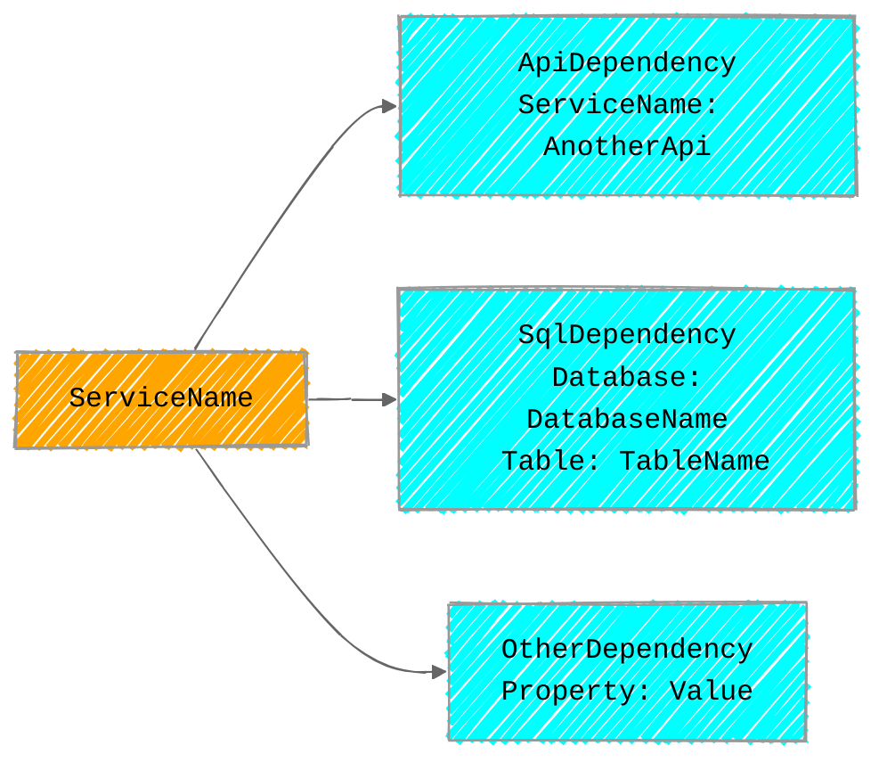
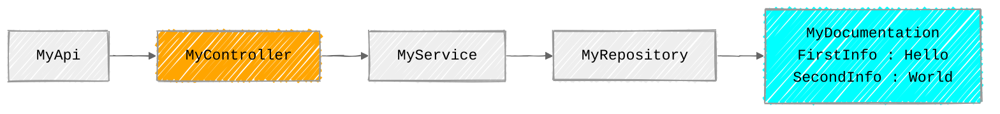
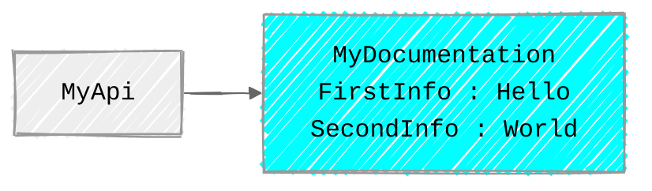

# Description

This cli application generates 2 types of graphs from a visual studio solution (.sln file). The output format can be json, yaml, mmd or svg.

The 2 types of graphs are

## ExternalOnly Graph

This graphs shows only the service represented by the solution and the external dependencies



## Full Graph

This graph shows 

* the service represented by the solution
* the types dependencies from root types (api controllers)
* the external dependencies


# Quick start

## Install

```bash
dotnet tool install -g cli.slndoc
```

## Create an example project

Create an aspnet core webapi project with controllers (the solution file is located here : <MyApiFolder>\MyApi.sln)

Create an Attribute class

```csharp
internal class MyDocumentationAttribute: Attribute
{
	public string FirstInfo {get; set;}
	public string SecondInfo {get; set;}
}
```

> [!warning]
>
> The merge feature uses these attributes to replace a node by its graph. 
> In order to enable this feature to work well, an attribute having a **ServiceName** property is required. Its value should be the name of the root node of the dependency service
>
> ```csharp
> [ApiDependency(ServiceName="Another.Service")]
> ```
>
> ```mermaid
> flowchart LR
> 	classDef className fill:#ffffff,stroke:#333,stroke-width:0px;
> 	
> 	Another.Service --> a(...):::className
>  	Another.Service --> b(...):::className
>     Another.Service --> c(...):::className
> 						
> ```

Create a repository class, decorate it with your attribute and create the corresponding interface.

```csharp
[MyDocumentation(FirstInfo="Hello", SecondInfo="World")]
internal class MyRepository: IMyRepository
{
	
}

public interface IMyRepository{}
```

Create a service class, declare the repository as a dependency in the constructor and create the corresponding interface.

```csharp
internal class MyService: IMyService
{
	private readonly IMyRepository _myRepository;
	MyService(IMyRepository myRepository)
	{
		_myRepository = myRepository;
	}
}

public interface IMyService{}
```

Declare the service as a dependency of a controller in its constructor

```csharp
[ApiController]
[Route("[controller]")]
public class MyController: ControllerBase
{
	private readonly IMyService _myService;
	MyController(IMyService myService)
	{
		_myService = myService;
	}
}
```


## Define your settings

> [!NOTE]
>
> There are 2 settings that can be set : 
>
> * `attributes-to-scan` : The names of the attributes types that represents the external dependencies in the code. The `ApiDependency` attribute with "ServiceName" property is a special attribute used on merges.
>
> * `exclude-classes` : The names of the types that won't be included in the graph


Display the values of the current settings

 ```bash
▶ slndoc settings show
 ```

 *Result*

 ```json
Storage folder :C:\<<path to appsettings.json>>
{
     "AttributesToScan": [
        "SqlDependency",
        "CosmosDbDependency",
        "RedisDependency",
        "ApiDependency",
        "PackageDependency"
    ],
    "ExportExclusionsRegex": [
        "^ILogger\u003C.*",
        "^HttpClient$"
    ]
}
 ```

:arrow_right: The attributes defined are not relevant for our project and the one we need is not present


Set the attributes types names to scan

```
▶ slndoc settings set attributes-to-scan MyDocumentation MyDocumentationAttribute
```

## Run graph generation

Run full extraction to json file as **hierarchical** tree *(use of -h option)*

```
▶ slndoc extract -i "./MyApi.sln" -o "./example/MyApi/docs/generated/full.hierarchical.dependencies" -r MyApi -h
```

*Result* [full.hierarchical.dependencies.json](./example/MyApi/docs/generated/full.hierarchical.dependencies.json)

Run full extraction to json file as **non hierarchical** tree **

```
▶ slndoc extract -i "./MyApi.sln" -o "./example/MyApi/docs/generated/full.hierarchical.dependencies" -r MyApi
```

*Result* [full.dependencies.json](./example/MyApi/docs/generated/full.dependencies.json)

Run full extraction to json file as **external-only** tree *(use of -h option)*

```
▶ slndoc extract -i "./MyApi.sln" -o "./example/MyApi/docs/generated/external.dependencies" -r MyApi -e
```

*Result* [external.dependencies.json](./example/MyApi/docs/generated/external.dependencies.json)


Run full extraction to mermaid file

```
▶ slndoc extract -i "C:\dev\temp\MyApi\MyApi.sln" -o C:\dev\temp\MyApi\docs\generated\MyApi.graph.mmd
```

*Result as code*

```
%%{
    init: {
    "theme": "neutral",
    "fontFamily": "monospace",
    "flowchart": {
        "htmlLabels": true,
        "curve": "basis"
    },
    "look": "handDrawn"
    }
}%%
flowchart LR
classDef root fill:orange
classDef servicedependency fill:cyan
MyController:::root
MyApi --> MyController
MyController --> MyService
MyService
MyService --> MyRepository
MyRepository
MyDocumentation#08727988-a81d-49ee-8a9e-07a6d923a9f6["MyDocumentation<br/> FirstInfo :  Hello<br/>SecondInfo :  World "]:::servicedependency
MyRepository --> MyDocumentation#08727988-a81d-49ee-8a9e-07a6d923a9f6
```


*Result as viz*




Run external dependencies only extraction to mermaid file

```
▶ slndoc extract -i "C:\dev\temp\MyApi\MyApi.sln" -o C:\dev\temp\MyApi\docs\generated\MyApi.graph.mmd -e
```

*Result as viz*




# Commands

## slndoc show-full-help

### Usage

  slndoc show-full-help `[options]`

### Options

 `-o|--output-markdown`  Output markdown file
  -?|-h|--help          Show help information.


## slndoc extract

Parses a solution (.sln) starting from api controllers and creates a dependency tree.

### Usage

  slndoc extract `[options]`

### Options

 `-i|--input-path`     The path to the sln file
 `-o|--output-path`    The path to the result file. The file type is given by one of the following extensions : json,
                      yaml|yml, mmd, svg
 `-r|--root-name`      [Required. the name of the root of the graph
 `-e|--external-only`  [Optional] (default : false). Determines if internal classes should be fetched (false) or not
                      (true)
 `-h|--hierarchical`   [Optional] (default: false) Determines if the export format is hierarchical or not. This option
                      has no impact on mermaid exrection.
  -?|--help           Show help information.


## slndoc merge

Merge two or more exported documents into one document.

### Usage

  slndoc merge `[options]` 	

### Arguments

  FilesPaths    The files to merge.

### Options

 `-o|--output`   The output file path for the merged document.
  -?|-h|--help  Show help information.


## slndoc export

Loads a non hierarchical json file and generates a mermaid file.

### Usage

  slndoc export `[options]`

### Options

 `-i|--input-path`   The path to the sln file
 `-o|--output-path`  The path to the resulting mermaid file.
  -?|-h|--help      Show help information.


## slndoc settings show

### Usage

  slndoc settings show `[options]`

### Options

  -?|-h|--help  Show help information.


## slndoc settings switchto

### Usage

  slndoc settings switchto `[options]` 	

### Arguments

  Environment   

### Options

  -?|-h|--help  Show help information.


## slndoc settings set exclude-classes

### Usage

  slndoc settings set exclude-classes `[options]` 	

### Arguments

  ExclusionRegexex  List of the names of the regexes to exclude class names
                    Example: 	 exclude-classes ^ILogger<.* ^string$

### Options

 `-e|--environment`  Environment to set the settings for
  -?|-h|--help      Show help information.


## slndoc settings set attributes-to-scan

### Usage

  slndoc settings set attributes-to-scan `[options]` 	

### Arguments

  Attributes        List of the names of the attributes that represent a dependency : Array of string in json format
                    Example: 	 attributes-to-scan attr1 attr2 attr3

### Options

 `-e|--environment`  Environment to set the settings for
  -?|-h|--help      Show help information.


## slndoc settings delete

### Usage

  slndoc settings delete `[options]` 	

### Arguments

  Environment   

### Options

  -?|-h|--help  Show help information.


## slndoc ping

### Usage

  slndoc ping `[options]`

### Options

  -?|-h|--help  Show help information.


